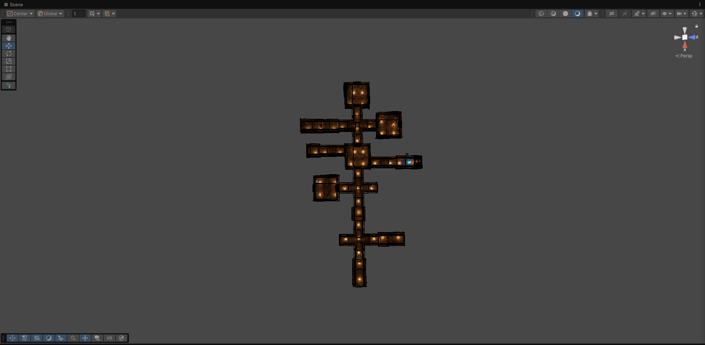
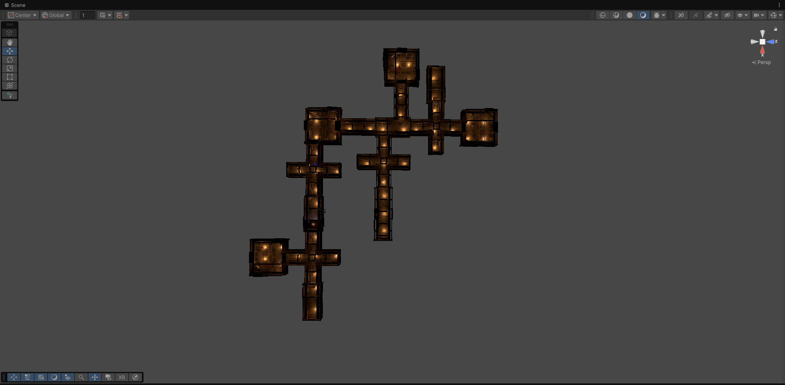
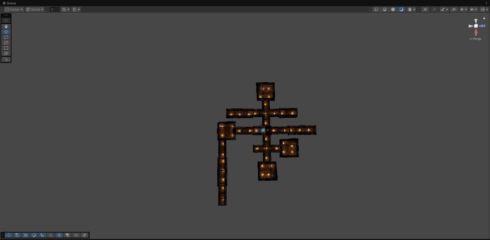
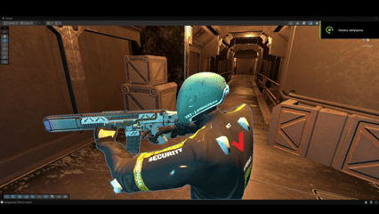
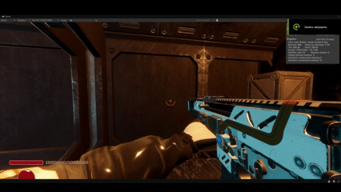
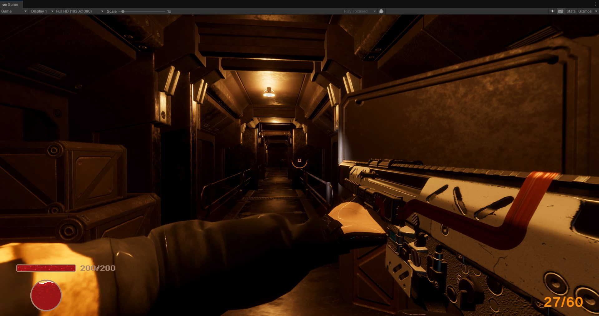
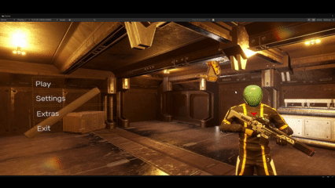

# ECS Shooter

Шутер от первого лица на Unity 6 HDRP с архитектурой LeoECS + Zenject.

## О проекте

Демо-проект шутера с процедурной генерацией и ECS-архитектурой. Включает игрока, оружие, врагов дальнего боя, турели. Вся игровая логика реализована через ECS-системы, а MonoBehaviours отвечают только за view-слой.

Уровень генерируется процедурно на старте сцены: комнаты соединяются случайными коридорами, внутри расставляются точки патруля, спавны врагов и предметы.

## Генерация уровней

Примеры процедурной генерации — каждый запуск создаёт новую комбинацию комнат и коридоров.

| Пример 1 | Пример 2 | Пример 3 |
|---|---|---|
|  |  |  |

## Перезарядка оружия

Кастомная анимация перезарядки: магазин физически вынимается из оружия, удерживается левой рукой и вставляется обратно. Правая рука остаётся на оружии через IK, магазин перемещается по ключевым кадрам анимации.

| Сцена                                              | Игра                                              |
|----------------------------------------------------|---------------------------------------------------|
|  |  |

## Геймплей

## Меню

## Стек

- **Unity 6** (HDRP)
- **LeoECS** (+ Voody UniLeo для конвертации сцены)
- **Zenject** — DI
- **UniRx** — реактивные поля здоровья и патронов
- **UniTask** — асинхронные операции
- **Cinemachine** — камеры (FPV/TPV)
- **NavMesh** — AI передвижение
- **TextMeshPro** — UI

## Что реализовано

- [x] Передвижение (ходьба, бег, прыжок, присед)
- [x] Оружие с магазином, перезарядкой, IK-хват
- [x] Кастомная анимация перезарядки
- [x] Пули через ObjectPool
- [x] Враги ближнего боя с NavMesh-патрулём и атакой
- [x] Турели с патрулированием по углу и наведением
- [x] Процедурная генерация уровней
- [x] Система здоровья и смерти
- [x] UI (HP, патроны)
- [x] Звуки (ambient, выстрел)
- [x] Спавн через конфиги + фабрики

## Управление

| Клавиша | Действие |
|---|---|
| `W A S D` | Передвижение |
| `Shift` | Бег |
| `Ctrl` | Присед |
| `Space` | Прыжок |
| `Mouse0 (LMB)` | Стрельба |
| `R` | Перезарядка |